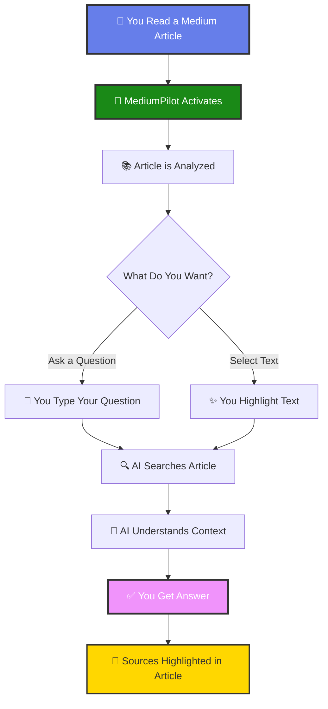
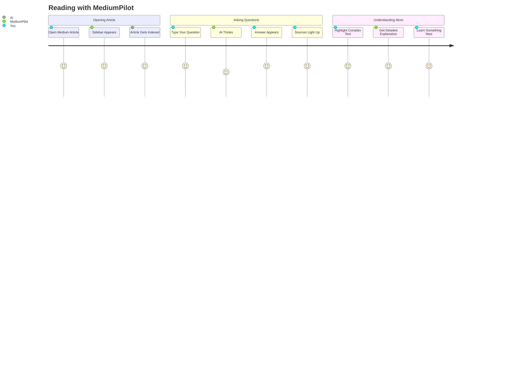
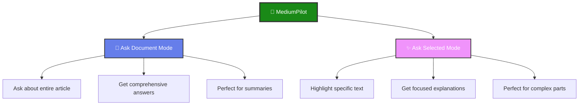
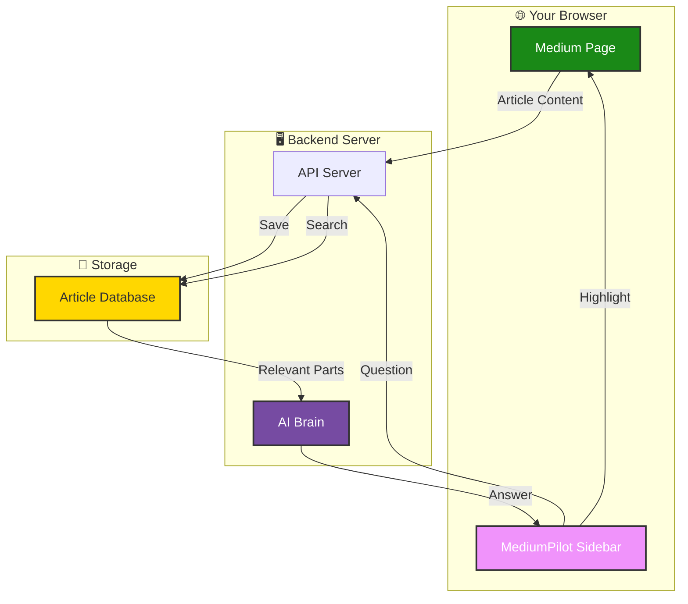
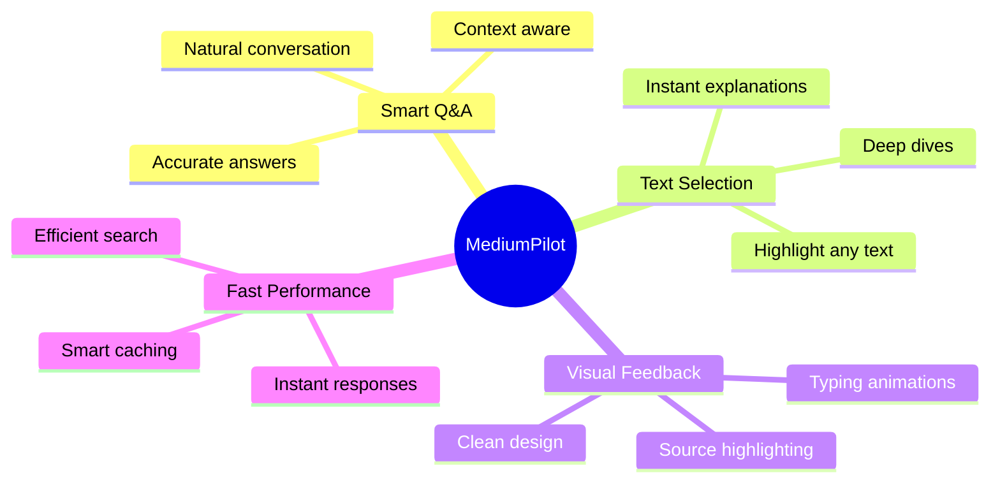
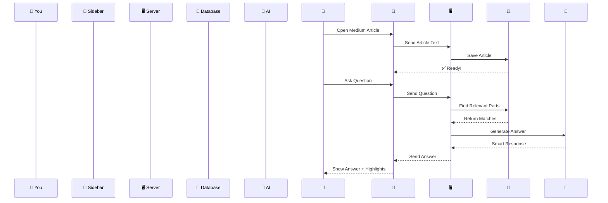
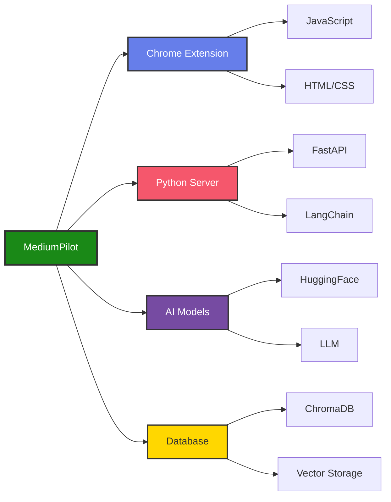

# 🚀 MediumPilot

<div align="center">


**Your AI companion for reading Medium articles**

[📺 Watch Demo](#demo) • [🎯 Features](#features) • [⚡ Quick Start](#quick-start) • [💡 How It Works](#how-it-works)

</div>

---

## 📺 Demo

<div align="center">

[](https://www.youtube.com/watch?v=YOUR_VIDEO_ID)

**Click above to watch the demo video**

</div>

---

## 🎯 What is MediumPilot?

MediumPilot is a Chrome extension that adds an **AI assistant** to every Medium article you read. Ask questions, get explanations, and understand complex topics—all without leaving the page.

### ✨ Features

- 💬 **Chat with Articles** - Ask any question about the article
- ✨ **Explain Selected Text** - Highlight text and get instant explanations  
- 🎯 **Smart Answers** - Responses based on the actual article content
- 🔍 **Source Highlighting** - See exactly where answers come from
- 🎨 **Beautiful Design** - Clean sidebar that fits Medium's style
- ⚡ **Fast & Free** - Instant responses powered by AI

---

## 📊 How MediumPilot Works



---

## 🎬 User Journey



---

## 🔄 Complete Flow


---

## ⚡ Quick Start

### 1️⃣ Install Backend

```bash
# Clone the project
git clone https://github.com/yourusername/mediumpilot.git
cd mediumpilot

# Install Python packages
pip install -r requirements.txt

# Add your API key
echo "HF_TOKEN=your_token_here" > .env

# Start server
python -m uvicorn main:app --reload
```

### 2️⃣ Install Extension

1. Open Chrome → Go to `chrome://extensions/`
2. Turn on **Developer mode**
3. Click **Load unpacked**
4. Select the extension folder
5. Done! 🎉

### 3️⃣ Use It

1. Visit any Medium article
2. See the sidebar appear on the right
3. Start asking questions!

---

## 💡 Two Ways to Use



---

## 🏗️ System Overview



---

## 📱 What You'll See

### The Sidebar

- **Header** - Shows status (Indexing/Ready)
- **Mode Switch** - Toggle between "Ask Document" and "Ask Selected"
- **Chat Area** - Your conversation with AI
- **Input Box** - Where you type questions

### The Magic

When you ask a question:
1. AI searches the article
2. Finds relevant paragraphs
3. Creates a clear answer
4. Highlights those paragraphs in yellow
5. Shows answer in the sidebar

---

## 🎨 Features in Detail



---

## 📂 Project Files

```
mediumpilot/
│
├── 🔧 Backend (Python)
│   ├── main.py                 → Main server
│   ├── loader.py               → Process articles
│   ├── embeddings_store.py     → Save to database
│   ├── retrieval.py            → Search articles
│   ├── rag_argumentation.py    → Build prompts
│   └── rag_generation.py       → Generate answers
│
├── 🎨 Extension (JavaScript)
│   ├── manifest.json           → Extension setup
│   ├── contentScript.js        → Extract articles
│   ├── sidebar.html            → UI structure
│   ├── sidebar.js              → UI logic
│   └── sidebar.css             → Styling
│
└── 📚 Database
    └── chroma_vector_db/       → Stored articles
```

---

## 🔄 Behind the Scenes



---

## 🛠️ Technologies Used



---

## 🚀 Coming Soon

- 🎤 Voice input for questions
- 🔊 Listen to answers
- 📱 Mobile browser support
- 🌍 Multiple languages
- 📝 Save conversation history
- 🤝 Share insights with friends

---

## ❓ FAQ

**Q: Is it free?**  
A: Yes! You just need a free HuggingFace account.

**Q: Does it work on all websites?**  
A: Currently only Medium.com articles.

**Q: Is my data private?**  
A: Articles are stored locally on your computer.

**Q: Can I use it offline?**  
A: No, it needs internet for AI responses.

---

## 🤝 Contributing

Want to help make MediumPilot better?

1. Fork this repository
2. Make your improvements
3. Submit a pull request
4. We'll review and merge!

---

## 📧 Contact

**Created by Anish Deshmukh**

- GitHub: [@anishdeshmukhO9](https://github.com/anishdeshmukhO9)
- Email: your.email@example.com

---

<div align="center">

### ⭐ Enjoying MediumPilot? Give us a star!

**Made with ❤️ for better reading**

</div>
